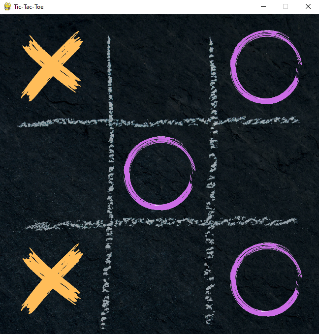
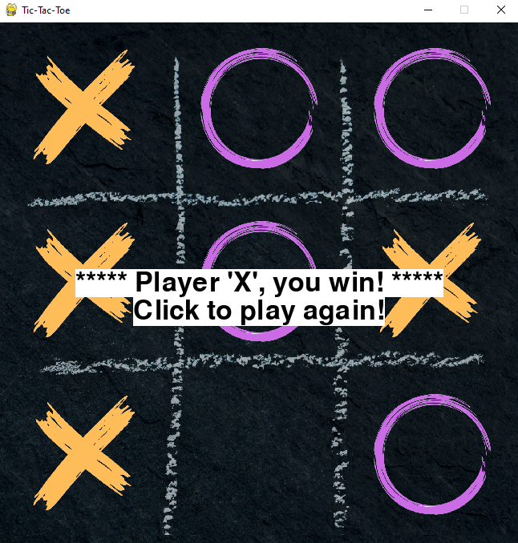

# Tic-Tac-Toe game in Python

## SUMMARY
This project uses Python and PyGame to create the classic Tic-Tac-Toe game for two players. The game can be played on the terminal or as a GUI.

### GUI mode:

    
    

### Terminal mode:

## How to run this program
1. Download this project
2. Open the temrinal and install the project using: `pip install .`
3. Run the game:
    * For the GUI mode use the command: `tic_tac_toe`
    * For the terminal mode use the command: `tic_tac_toe --cli`

